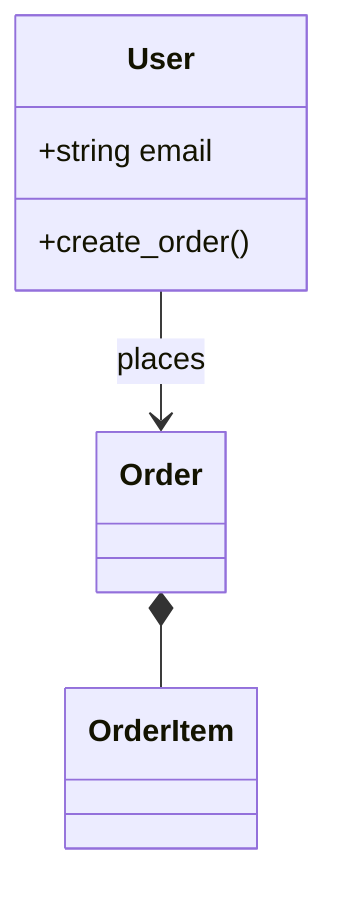
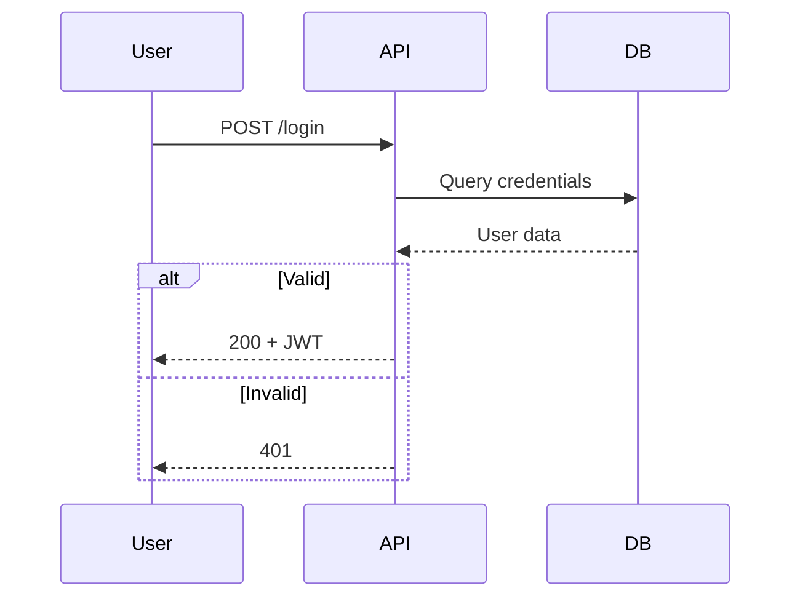
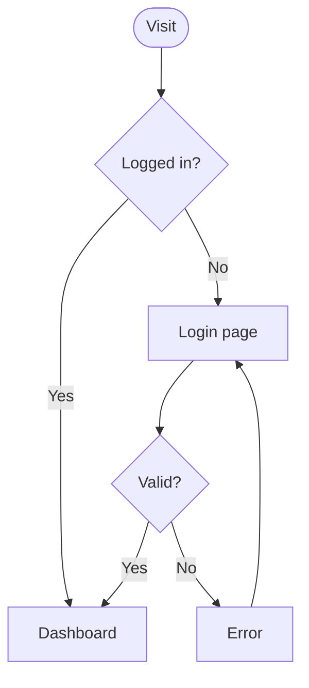
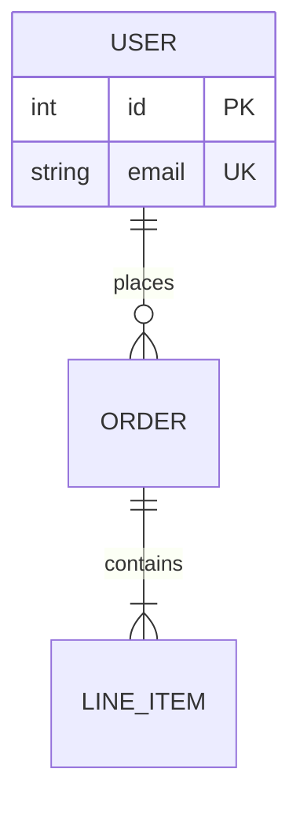

# Mermaid Diagramming

Create professional software diagrams using Mermaid's text-based syntax.

## Expert Guidance: Which Diagram Type?

| Audience | Time to Create | Maintenance | Recommended Type |
|----------|----------------|-------------|------------------|
| Developer (self) | 5 min | Update with code | Flowchart, Sequence |
| Team review | 15 min | Monthly | Class, ERD |
| External stakeholders | 30 min | Quarterly | C4 Context/Container |
| Documentation | 10 min | With releases | Sequence, State |

**Rule:** Match diagram complexity to how often it will be viewed and updated. Over-detailed diagrams become stale.

## When to Use Which

```
What are you showing?
├─ Data relationships → ERD
├─ Object structure → Class Diagram
├─ Time-based flow → Sequence Diagram
├─ Process/algorithm → Flowchart
├─ System boundaries → C4 Diagram
└─ State transitions → State Diagram
```

## Quick Examples

### Class Diagram


### Sequence Diagram


### Flowchart


### ERD


## Anti-Patterns

| Pattern | Problem | Fix |
|---------|---------|-----|
| **The Kitchen Sink** | 50+ nodes, unreadable | Split into multiple diagrams |
| **Wrong Abstraction** | ERD for process flow | Match diagram type to content |
| **Missing Legend** | Custom notation unexplained | Add `%% Legend:` comment |
| **Dead Diagram** | Code changed, diagram didn't | Store near code, update together |
| **Over-Detailed** | Implementation details in architecture | Match detail level to audience |

## Rendering

Native support: GitHub, GitLab, VS Code, Notion, Obsidian

Export: [Mermaid Live Editor](https://mermaid.live) or CLI `mmdc -i input.mmd -o output.png`
