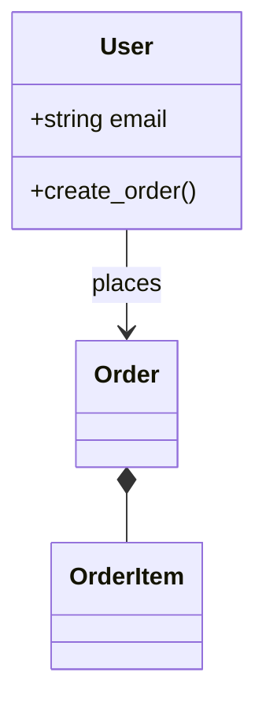
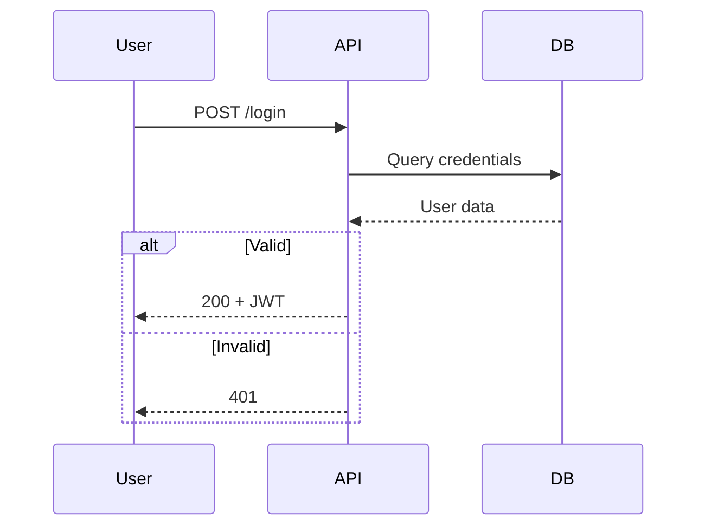
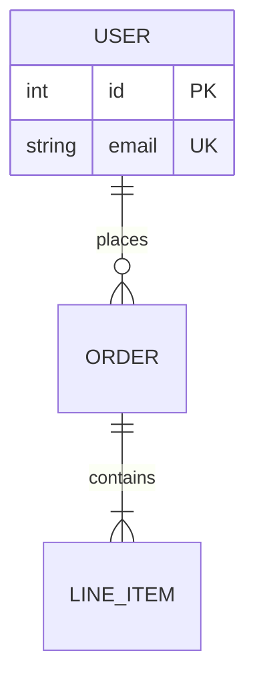

# Mermaid Diagramming

Create professional software diagrams using Mermaid's text-based syntax.

## Diagram Type Selection

| Type | Use For |
|------|---------|
| Class Diagrams | Domain modeling, OOP design, entity relationships |
| Sequence Diagrams | API flows, auth sequences, component interactions |
| Flowcharts | User journeys, processes, algorithms, pipelines |
| ERD | Database schemas, data modeling |
| C4 Diagrams | System architecture at multiple levels |
| State Diagrams | State machines, lifecycle states |

## Quick Examples

### Class Diagram

### Sequence Diagram

### Flowchart

### ERD

## Syntax Reference

**Comments:** `%% This is a comment`

**Relationships (Class):**
- `A -- B` Association
- `A --> B` Directed
- `A *-- B` Composition
- `A o-- B` Aggregation
- `A <|-- B` Inheritance

**Arrows (Sequence):**
- `->>` Sync request
- `-->>` Sync response
- `--)` Async

**Shapes (Flowchart):**
- `[Rectangle]`
- `([Stadium])`
- `{Diamond}`
- `((Circle))`

## Best Practices

1. Start simple, add details incrementally
2. One concept per diagram
3. Use meaningful names
4. Comment complex relationships with `%%`
5. Store `.mmd` files alongside code

## Rendering

Native support: GitHub, GitLab, VS Code, Notion, Obsidian

Export: [Mermaid Live Editor](https://mermaid.live) or CLI `mmdc -i input.mmd -o output.png`
